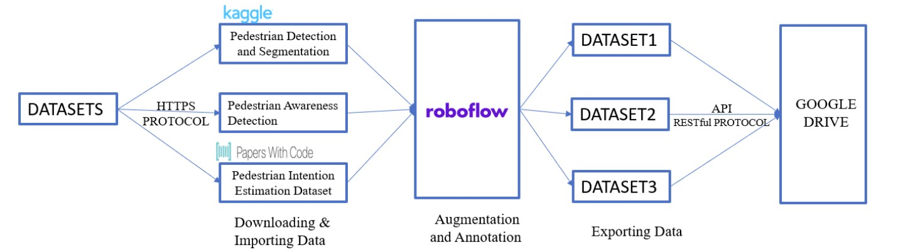
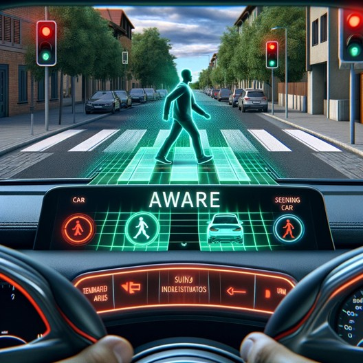
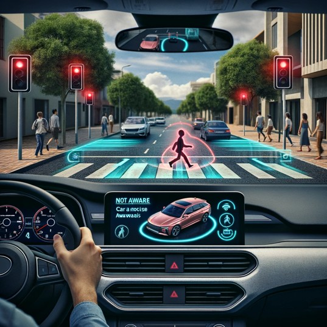

# 🚀 Autonomous Vehicle Pedestrian Analysis

Welcome to the **Autonomous Vehicle Pedestrian Analysis** repository! This project focuses on developing advanced pedestrian detection models to classify pedestrian behavior in real-time, leveraging the YOLOv9 model. Our aim is to enhance road safety through robust pedestrian behavior analysis.

---

## 🔧 Project Overview

- **Objective**: Analyze and classify pedestrian behavior as 'Aware' or 'Not Aware' during road-crossing scenarios.
- **Tech Stack**: YOLOv9, Roboflow, Python, Google Colab, RESTful API.
- **Datasets Used**:
  - [Penn-Fudan Database for Pedestrian Detection and Segmentation](https://www.kaggle.com/datasets/psvishnu/pennfudan-database-for-pedestrian-detection-zip)
  - [Pedestrian Intention Estimation Dataset](https://paperswithcode.com/dataset/pie)
  - Custom dataset from real-world pedestrian scenarios.

---

## 📂 Table of Contents

1. [Introduction](#introduction)
2. [Architecture](#architecture)
3. [Datasets and Preprocessing](#datasets-and-preprocessing)
4. [Model Training and Testing](#model-training-and-testing)
5. [Results](#results)
6. [Future Work](#future-work)
7. [Acknowledgements](#acknowledgements)

---

## 🌟 Introduction

Pedestrian behavior analysis is crucial for autonomous driving systems to predict and react to real-world road scenarios. This project leverages deep learning and real-time detection to classify pedestrians into 'Aware' and 'Not Aware' categories, enhancing safety for both pedestrians and drivers.

---

## 🏗️ Architecture

Our workflow consists of:
1. **Dataset Collection**: Sourcing from Kaggle, Papers with Code, and custom data.
2. **Data Annotation and Augmentation**: Using Roboflow for splitting, labeling, and augmenting datasets.
3. **Model Training**: YOLOv9 is trained using Google Colab and stored in Google Drive.
4. **Prediction**: Outputs pedestrian behavior predictions in real-time.

---

## 📊 Datasets and Preprocessing

We utilized three datasets to enhance model robustness:
- **Dataset 1**: Pedestrian detection and segmentation.
- **Dataset 2**: Intention estimation dataset to classify crossing intentions.
- **Dataset 3**: Custom dataset focusing on pedestrian awareness.

Data augmentation techniques included:
- Horizontal flips
- Rotations (-15° to +15°)
- Hue adjustments (-25 to +25)

---

## 🧪 Model Training and Testing

- **Model**: YOLOv9, chosen for its high accuracy and real-time performance.
- **Training**: Conducted on Google Colab with datasets split into 80% training, 15% validation, and 5% testing.
- **Performance Metrics**:
  - Accuracy: 92.5%
  - Precision: 93.8%
  - Recall: 91.0%
  - F1 Score: 92.4%

---

## 🏆 Results

### Key Predictions

*Figure: The model accurately detects a pedestrian as 'Aware' with a high confidence score.*

*Figure: The model identifies a pedestrian as 'Not Aware', aiding in proactive accident prevention.*

---

## 🚀 Future Work

- **Data Expansion**: Include scenarios with varying weather conditions and diverse urban settings.
- **Multimodal Inputs**: Integrate LiDAR and thermal imaging for enhanced detection.
- **Efficiency Optimizations**: Explore lightweight architectures for edge devices.

---

## 🙏 Acknowledgements

We would like to thank [Roboflow](https://roboflow.com/) for their annotation and augmentation tools and the contributors of the datasets for enabling this project.

---

👋 **Thank you for exploring this repository!** If you have any suggestions or contributions, feel free to [open an issue](https://github.com/your-repo/issues) or submit a pull request.
