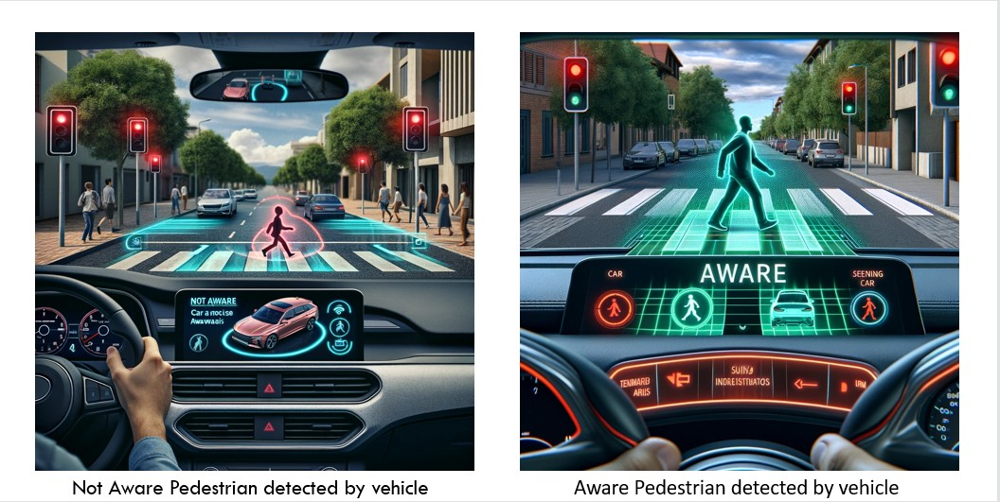
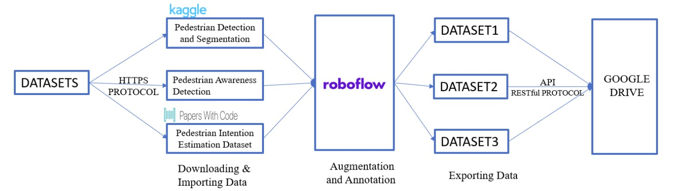
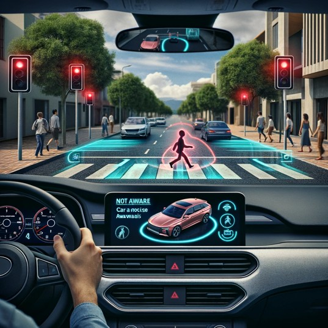

# 🚀 Autonomous Vehicle Pedestrian Analysis

Welcome to the **Autonomous Vehicle Pedestrian Analysis** repository! This project focuses on developing advanced pedestrian detection models to classify pedestrian behavior in real-time, leveraging the YOLOv9 model. Main aim is to enhance road safety through robust pedestrian behavior analysis.

---

## 🔧 Project Overview

- **Objective**: Analyze and classify pedestrian behavior during road-crossing scenarios.
- **Tech Stack**: YOLOv9, Roboflow, Python, Google Colab, RESTful API.
- **Datasets Used**:
  - [Penn-Fudan Database for Pedestrian Detection and Segmentation](https://www.kaggle.com/datasets/psvishnu/pennfudan-database-for-pedestrian-detection-zip)
  - [Pedestrian Intention Estimation Dataset](https://paperswithcode.com/dataset/pie)
  - Custom dataset from real-world pedestrian scenarios.

---

## 📂 Table of Contents

1. [Introduction](#introduction)
2. [Architecture](#architecture)
3. [Datasets and Preprocessing](#datasets-and-preprocessing)
4. [Model Training and Testing](#model-training-and-testing)
5. [Results](#results)
6. [Future Work](#future-work)
7. [Acknowledgements](#acknowledgements)

---

## 🌟 Introduction

Pedestrian behavior analysis is crucial for autonomous driving systems to predict and react to real-world road scenarios. 
- Prioritizing safety is the utmost concern when designing autonomous vehicles 
- Many factors affect pedestrian safety
- Autonomous vehicles must be aware of their surroundings to prevent accidents
- It could be challenging for both the pedestrian and the driver, as their motions are notoriously unpredictable and certain
- Though many pedestrians know not to go, children and young walkers who aren't paying attention risk entering traffic
- Vehicles that have pedestrian awareness have fewer accidents and avoid traffic congestion. 
- Pedestrian behaviour is the primary subject of this research, which takes into account variables such as crossing, not crossing, intention, and more

---

## 🏗️ Architecture

Figure illustrates the workflow of data processing for a pedestrian detection model. Starting with datasets sourced from Kaggle, Papers with Code, and custom data, it follows the data's journey via HTTPS and RESTful API protocols through Roboflow, where augmentation and annotation occur before the processed datasets are exported to Google Drive for model training and storage. The project examined multiple datasets to address the complexity of real-world pedestrian behavior analysis. Multiple pedestrians per image, a variety of pedestrian stances, and realworld image quality were chosen for each dataset. Our method stressed the importance of combining multiple data sources to 

---

Workflow consists of:
1. **Dataset Collection**: Sourcing from Kaggle, Papers with Code, and custom data.
2. **Data Annotation and Augmentation**: Using Roboflow for splitting, labeling, and augmenting datasets.
3. **Model Training**: YOLOv9 is trained using Google Colab and stored in Google Drive.
4. **Prediction**: Outputs pedestrian behavior predictions in real-time.

---
## 📊 Datasets and Preprocessing

Utilized three datasets to enhance model robustness:
- **Dataset 1**: Pedestrian detection and segmentation.
  --
  The initial dataset 1 employed the Penn-Fudan Database (PF) to specifically detect the head orientations of pedestrians to classify their level of awareness. The initial labelling process involved the utilization of specific categories.
  - Potentially Intersecting Path and Aware
  - Intersecting Path and Aware
  - Intersection Path and Not Aware
  - Recently Intersected Path and Aware
  - Recently Intersected Path and Not Aware
  - Potentially Intersecting Path and Not Aware
  - Not Intersecting

- **Dataset 2**: Intention estimation dataset to classify crossing intentions.
  --
  Utilizing the PIE dataset, this experiment extracted frames from video footage that documented active pedestrian zones in urban environments. The objective was to improve the model's capacity to identify shifts in pedestrian intentions, progressing from having no intention to intending to cross, and ultimately to crossing. This refined categorization facilitates prompt notifications for drivers.
  - Intending to cross
  - No intention
  - Crossing

- **Dataset 3**: Custom dataset focusing on pedestrian awareness.
  --
  Data augmentation techniques included:
  - Horizontal flips
  - Rotations (-15° to +15°)
  - Hue adjustments (-25 to +25)

---

## 🧪 Model Training and Testing

- **Model**: YOLOv9, chosen for its high accuracy and real-time performance.
- **Training**: Conducted on Google Colab with datasets split into 80% training, 15% validation, and 5% testing.
- **Performance Metrics**:
  - Accuracy: 92.5%
  - Precision: 93.8%
  - Recall: 91.0%
  - F1 Score: 92.4%

---

## 🏆 Results

### Key Predictions

*Figure: The model accurately detects a pedestrian as 'Aware' with a high confidence score.*

*Figure: The model identifies a pedestrian as 'Not Aware', aiding in proactive accident prevention.*

---

## 🚀 Future Work

- **Data Expansion**: Include scenarios with varying weather conditions and diverse urban settings.
- **Multimodal Inputs**: Integrate LiDAR and thermal imaging for enhanced detection.
- **Efficiency Optimizations**: Explore lightweight architectures for edge devices.

---

## 🙏 Acknowledgements

Would like to thank [Roboflow](https://roboflow.com/) for their annotation and augmentation tools and the contributors of the datasets for enabling this project.

---

👋 **Thank you for exploring this repository!**
