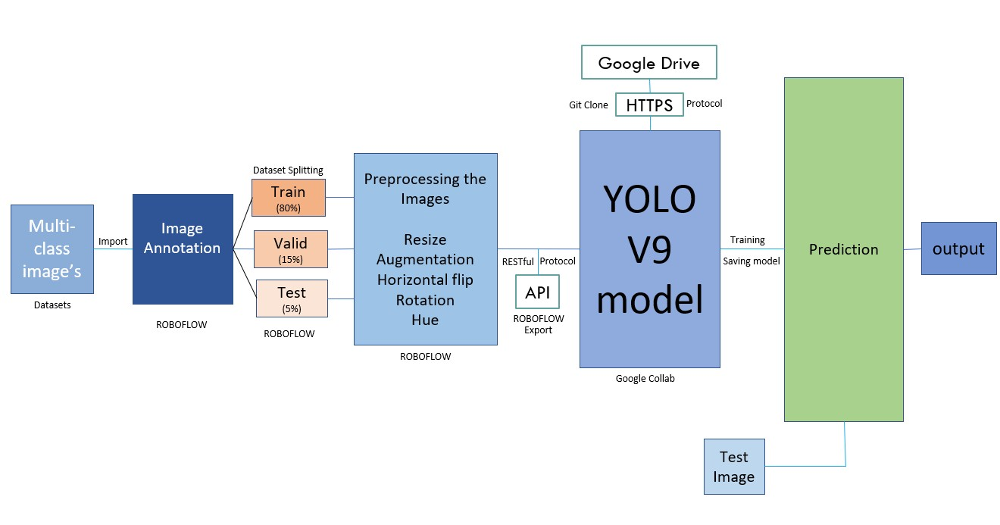

# 🚀 Autonomous Vehicle Pedestrian Analysis

Welcome to the **Autonomous Vehicle Pedestrian Analysis** repository! This project focuses on developing advanced pedestrian detection models to classify pedestrian behavior in real-time, leveraging the YOLOv9 model. Main aim is to enhance road safety through robust pedestrian behavior analysis.

---

## 🔧 Project Overview


- **Objective**: Analyze and classify pedestrian behavior during road-crossing scenarios.
- **Tech Stack**: YOLOv9, Roboflow, Python, Google Colab, RESTful API.
- **Datasets Used**:
  - [Penn-Fudan Database for Pedestrian Detection and Segmentation](https://www.kaggle.com/datasets/psvishnu/pennfudan-database-for-pedestrian-detection-zip)
  - [Pedestrian Intention Estimation Dataset](https://paperswithcode.com/dataset/pie)
  - Custom dataset from real-world pedestrian scenarios.


---

## 📂 Table of Contents

1. [Introduction](#introduction)
2. [Architecture](#architecture)
3. [Datasets and Preprocessing](#datasets-and-preprocessing)
4. [Model Training and Testing](#model-training-and-testing)
5. [Results](#results)
6. [Future Work](#future-work)
7. [Acknowledgements](#acknowledgements)

---

## 🌟 Introduction

Pedestrian behavior analysis is crucial for autonomous driving systems to predict and react to real-world road scenarios. 
- Prioritizing safety is the utmost concern when designing autonomous vehicles 
- Many factors affect pedestrian safety
- Autonomous vehicles must be aware of their surroundings to prevent accidents
- It could be challenging for both the pedestrian and the driver, as their motions are notoriously unpredictable and certain
- Though many pedestrians know not to go, children and young walkers who aren't paying attention risk entering traffic
- Vehicles that have pedestrian awareness have fewer accidents and avoid traffic congestion. 
- Pedestrian behaviour is the primary subject of this research, which takes into account variables such as crossing, not crossing, intention, and more

---

## 🏗️ Architecture

*Figure: Architecture*

Figure illustrates the workflow of data processing for a pedestrian detection model. Starting with datasets sourced from Kaggle, Papers with Code, and custom data, it follows the data's journey via HTTPS and RESTful API protocols through Roboflow, where augmentation and annotation occur before the processed datasets are exported to Google Drive for model training and storage. The project examined multiple datasets to address the complexity of real-world pedestrian behavior analysis. Multiple pedestrians per image, a variety of pedestrian stances, and realworld image quality were chosen for each dataset. Our method stressed the importance of combining multiple data sources to 

---

Workflow consists of:
1. **Dataset Collection**: Sourcing from Kaggle, Papers with Code, and custom data.
2. **Data Annotation and Augmentation**: Using Roboflow for splitting, labeling, and augmenting datasets.
3. **Model Training**: YOLOv9 is trained using Google Colab and stored in Google Drive.
4. **Prediction**: Outputs pedestrian behavior predictions in real-time.

---
## 📊 Datasets and Preprocessing


Utilized three datasets to enhance model robustness:
- **Dataset 1**: Pedestrian detection and segmentation.
  --
  The initial dataset 1 employed the Penn-Fudan Database (PF) to specifically detect the head orientations of pedestrians to classify their level of awareness. The initial labelling process involved the utilization of specific categories.
  - Potentially Intersecting Path and Aware
  - Intersecting Path and Aware
  - Intersection Path and Not Aware
  - Recently Intersected Path and Aware
  - Recently Intersected Path and Not Aware
  - Potentially Intersecting Path and Not Aware
  - Not Intersecting

- **Dataset 2**: Intention estimation dataset to classify crossing intentions.
  --
  Utilizing the PIE dataset, this experiment extracted frames from video footage that documented active pedestrian zones in urban environments. The objective was to improve the model's capacity to identify shifts in pedestrian intentions, progressing from having no intention to intending to cross, and ultimately to crossing. This refined categorization facilitates prompt notifications for drivers.
  - Intending to cross
  - No intention
  - Crossing

- **Dataset 3**: Custom dataset focusing on pedestrian awareness.
  --
  Data augmentation techniques included:
  - Horizontal flips
  - Rotations (-15° to +15°)
  - Hue adjustments (-25 to +25)

---

## 🧪 Model

- **Model**: YOLOv9, chosen for its high accuracy and real-time performance.

| **Model**        | **Architecture** | **Speed (FPS)** | **Accuracy** | **Memory Usage** | **Real-Time** |
|-------------------|------------------|-----------------|--------------|------------------|---------------|
| `YoloV9`         | CNN-based        | Very High       | High         | High             | Yes           |
| `YoloV8`         | CNN-based        | High            | High         | Moderate         | Yes           |
| `Faster R-Cnn`   | CNN-based        | Low             | Very High    | Low              | No            |
| `SSD`            | CNN-based        | Moderate        | Moderate     | Moderate         | Yes           |
| `HOG+SVM`        | Feature Extraction | Low          | Low          | Low              | No            |
| `RetinaNet`      | CNN-based        | Moderate        | High         | Moderate         | Yes           |
| `EfficientDet`   | CNN-based        | High            | Very High    | Moderate         | Yes           |
| `Transformer`    | Attention-based  | Moderate        | High         | High             | Yes           |

This model is renowned for its convolutional neural network (CNN) architecture, which provides exceptional speed and accuracy while utilizing a substantial amount of memory. As a result, it is highly suitable for real-time applications.
YOLOv9 is distinguished by its ability to process data in real time, its utilization of a single neural network architecture, its use of spatially separated bounding boxes for object detection, and its accurate and efficient classification of objects through class probability predictions. These features contribute to its exceptional performance in swiftly and accurately detecting and classifying objects.


- **Training**: Conducted on Google Colab with datasets split into 80% training, 15% validation, and 5% testing.
### Pseudocode

**Pseudocode for Pedestrian Behaviour Analysis using YOLOv9:**

```plaintext
Begin:
1. Import necessary libraries (NumPy, OpenCV, PyTorch, Roboflow, etc.)

2. Set up configuration paths for datasets and model weights:
     dataset_path = "/path/to/datasets"
     weights_path = "/path/to/yolov9/weights"

3. Data Acquisition and Management:
     - Load diverse datasets for comprehensive training (e.g., from Kaggle, custom datasets)
     - Combine and shuffle datasets to ensure variety
     - Split datasets into training (80%), validation (15%), and testing (5%)

4. Preprocessing and Data Augmentation:
     - Perform image resizing for uniformity
     - Apply augmentations like horizontal flipping, rotations, and hue adjustments
     - Annotate images with classes and bounding boxes using Roboflow

5. Model Initialization:
     - Instantiate the YOLOv9 model with pre-trained weights for transfer learning
     - Define training parameters (input resolution, epochs, learning rate)

6. Training Loop:
     - Use mini-batch gradient descent to iteratively train the model
     - Calculate and log loss at each iteration
     - Employ validation set for hyperparameter tuning and avoid overfitting

7. Model Evaluation:
    - Assess the model with metrics such as accuracy, precision, recall, and IoU
    - Perform detection on test images to calculate mean Average Precision (mAP)

8. Output Analysis:
     - Visualize the model's detection ability by plotting bounding boxes on test images
     - Analyze the model's speed by calculating Frames Per Second (FPS)

9. Model Persistence:
     - Save the trained model weights for future use
     - Document performance metrics for benchmarking

10. Deployment (optional):
     - Integrate the trained model into an application for real-time pedestrian detection
     - Set up an interface for ingesting live data streams

11. Continuous Improvement:
     - Establish a feedback loop to collect more data and update the model periodically

End

```
## 🏆 Results


*Figure: The model accurately detects a pedestrian as 'Aware' with a high confidence score., 'Not Aware', aiding in proactive accident prevention.*

### Key Predictions

- **Performance Metrics**:
  - Accuracy: 92.5%
  - Precision: 93.8%
  - Recall: 91.0%
  - F1 Score: 92.4%

| **Comparisons**          | **F1-Score** | **Recall** | **Precision** | **Accuracy** | **Miss Rate** |
|---------------------------|--------------|------------|---------------|--------------|---------------|
| **Our YOLOv9 Model**      | 92.4%        | 91.0%      | 93.8%         | 92.5%        | 9.0%          |
| **Existing YOLO Model**   | 86%          | 85%        | 89%           | 87.5%        | 22%           |

This comparative table , presents a clear distinction between the performance of our implemented YOLOv9 model
and a pre-existing version of YOLO in terms of pedestrian detection accuracy. Our YOLOv9 model surpasses the existing YOLO model across all listed performance metrics, underscoring significant improvements in detection capabilities. Notably, the F1 Score for our model stands at 92.4% compared to 86% of the existing model, indicating a better balance between precision and recall in our implementation. Furthermore, the table highlights a higher Recall (91.0% vs. 85%), Precision (93.8% vs. 89%), and Accuracy (92.5% vs. 87.5%) for our YOLOv9 model, demonstrating its enhanced ability to correctly identify pedestrian behavior. The Miss Rate of our model is more than halved at 9.0% against the existing model’s 22%, reflecting a significant reduction in the chances of missing actual pedestrian detections. This comparative analysis clearly suggests that the enhancements made in our YOLOv9 model have resulted in superior performance, making it a more reliable tool for real-time applications in pedestrian behavior analysis.

---

## 🚀 Future Work

- **Data Expansion**: Include scenarios with varying weather conditions and diverse urban settings.
- **Multimodal Inputs**: Integrate LiDAR and thermal imaging for enhanced detection.
- **Efficiency Optimizations**: Explore lightweight architectures for edge devices.

---

## 🙏 Acknowledgements

Would like to thank [Roboflow](https://roboflow.com/) for their annotation and augmentation tools and the contributors of the datasets for enabling this project.

---

👋 **Thank you for exploring this repository!**
